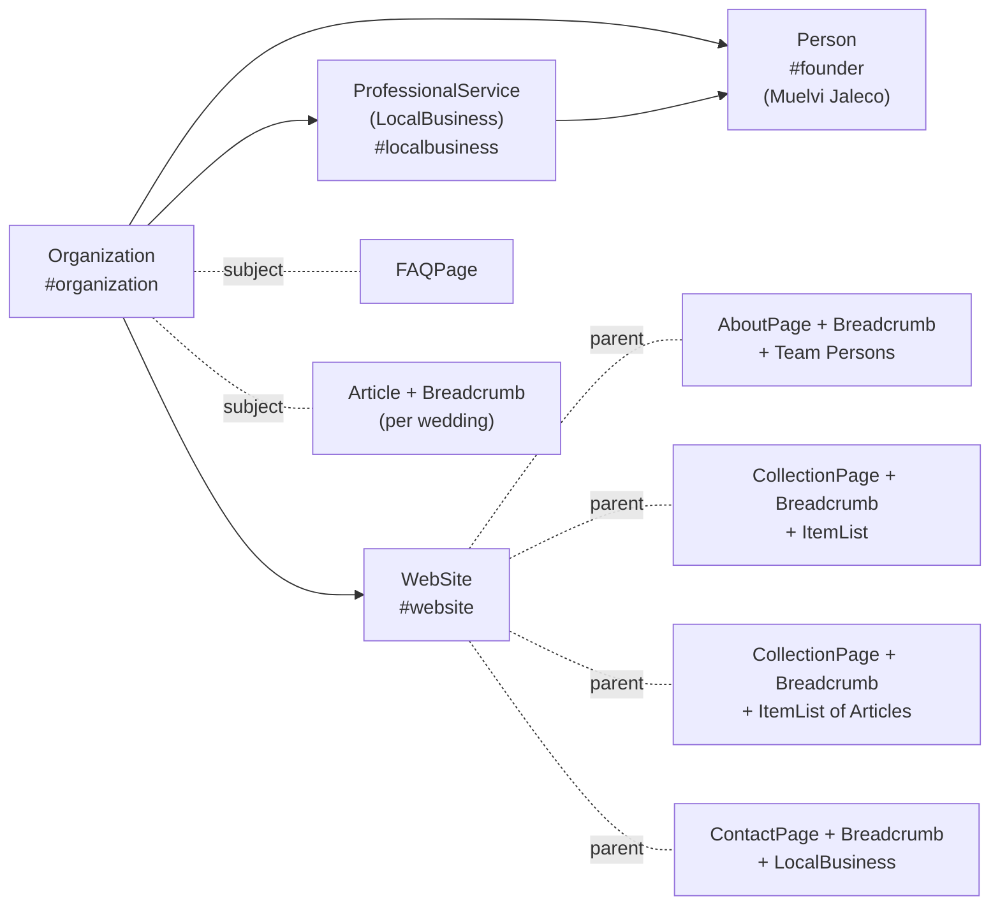

# SEO Strategy & Maintenance — Event by Jaleco

Research date: **2026-05-05**

This is the maintenance counterpart to the SEO build that ships in this repository. It documents the strategy, the file map, and the recurring tasks needed to keep the site visible in Google, Bing, and AI search surfaces (ChatGPT, Perplexity, Google AI Overviews).

## Contents

- [1. Strategy summary](#1-strategy-summary)
- [2. Keyword map](#2-keyword-map)
- [3. File map](#3-file-map)
- [4. JSON-LD graph](#4-json-ld-graph)
- [5. How to add a new wedding](#5-how-to-add-a-new-wedding)
- [6. How to enable journal indexing later](#6-how-to-enable-journal-indexing-later)
- [7. Off-site checklist (post-launch)](#7-off-site-checklist-post-launch)
- [8. Sources](#8-sources)

---

## 1. Strategy summary

The site is a Next.js 14 static export. It targets three audiences:

1. **Google organic** — couples searching `[place] wedding planner` and brand searches for the studio.
2. **AI search surfaces** — Google AI Overviews, ChatGPT (Bing-backed), Perplexity. ~48–55% of queries now show AI Overviews; 99% of cited sources come from the top 10 organic results, so winning AI citations starts with classic SEO.
3. **Social previews** — Instagram link-in-bio, Pinterest pins, share previews on iMessage / Slack / X.

The aesthetic constraints (cream backgrounds, restrained copy, no "Book Now" CTAs, no FAQ accordions, no pricing) come from [`research/01-luxury-wedding-sites-audit.md`](01-luxury-wedding-sites-audit.md). Where SEO best-practice would normally suggest visible FAQs / multiple CTAs / pricing pages, we route the SEO value through **invisible JSON-LD only** so the visual brand is preserved.

## 2. Keyword map

| Page | Primary keywords | Secondary |
| --- | --- | --- |
| `/` | boutique wedding planner Sydney, luxury wedding planner Australia, destination wedding planner | editorial wedding studio, candlelit wedding design |
| `/about` | Sydney wedding designer, Muelvi Jaleco, boutique wedding studio | Surry Hills wedding planner |
| `/work` | destination wedding planner, luxury wedding portfolio | private estate wedding |
| `/work/[slug]` | `[place] wedding planner`, `[region] wedding planner` | `[category] wedding`, destination wedding |
| `/press` | wedding planner press features, Vogue wedding planner | Harper's Bazaar, Town & Country, Brides |
| `/inquire` | contact wedding planner Sydney, inquire wedding studio | by appointment wedding studio |

The `keywords` Metadata field is largely ignored by Google but is still used by Bing and some AI surfaces. We include it where it's natural; we never stuff it.

## 3. File map

| File | Role |
| --- | --- |
| [`app/lib/seo.ts`](../app/lib/seo.ts) | Single source of truth: `SITE_URL`, `BUSINESS` (NAP, hours, geo), `SOCIAL`, `FOUNDER`, `TEAM`, env-driven `GA4_ID` / `GSC_VERIFICATION`, plus typed JSON-LD generators (`organizationLd`, `localBusinessLd`, `websiteLd`, `founderLd`, `personLd`, `faqLd`, `breadcrumbLd`, `workArticleLd`, `aboutPageLd`, `contactPageLd`, `collectionPageLd`, `workItemListLd`, `pressItemListLd`, `buildGraph`). |
| [`app/components/JsonLd.tsx`](../app/components/JsonLd.tsx) | Tiny server component that injects a JSON-LD `<script type="application/ld+json">` block. |
| [`app/layout.tsx`](../app/layout.tsx) | Global metadata (titles, OG, Twitter, icons, robots, verification, manifest) + global JSON-LD graph (Organization + LocalBusiness + WebSite + Person) + conditional GA4 script. |
| [`app/page.tsx`](../app/page.tsx) | Home metadata + invisible FAQPage JSON-LD (6 Q&As, all paraphrasing visible site copy). |
| [`app/about/page.tsx`](../app/about/page.tsx) | About metadata + AboutPage + Breadcrumb + extra Person entries for the team. |
| [`app/work/page.tsx`](../app/work/page.tsx) | Work metadata + CollectionPage + Breadcrumb + ItemList of all 12 weddings. |
| [`app/work/[slug]/page.tsx`](../app/work/%5Bslug%5D/page.tsx) | Per-wedding metadata (place-specific title + keywords + canonical + OG hero) + Breadcrumb + Article (with `author` = photographer Person, `about` = Place). |
| [`app/press/page.tsx`](../app/press/page.tsx) | Press metadata + CollectionPage + Breadcrumb + ItemList of features. |
| [`app/inquire/page.tsx`](../app/inquire/page.tsx) | Inquire metadata + ContactPage + Breadcrumb + LocalBusiness (with full opening hours and geo). |
| [`app/journal/page.tsx`](../app/journal/page.tsx) | Currently `noindex, follow` because the page is a placeholder. Re-enable indexing when real journal posts ship. |
| [`app/sitemap.ts`](../app/sitemap.ts) | Builds `out/sitemap.xml` enumerating every real route (omits `/journal`). |
| [`app/robots.ts`](../app/robots.ts) | Builds `out/robots.txt` allowing all UAs and pointing to the sitemap. |
| [`app/opengraph-image.tsx`](../app/opengraph-image.tsx) | Builds `out/opengraph-image.png` (1200×630, cream background, Cormorant wordmark) at compile time. |
| [`app/icon.tsx`](../app/icon.tsx) | Builds `out/icon.png` (32×32 favicon, J monogram). |
| [`app/apple-icon.tsx`](../app/apple-icon.tsx) | Builds `out/apple-icon.png` (180×180 iOS home-screen icon). |
| [`public/site.webmanifest`](../public/site.webmanifest) | PWA / mobile add-to-home metadata. |
| [`.env.example`](../.env.example) | Documents the two optional env vars. |

## 4. JSON-LD graph

Every page emits at least the global graph (from `app/layout.tsx`), plus its own page-specific blocks. The `@id` URIs are stable so Google can cross-reference them.

## 5. How to add a new wedding

The system is designed so you only edit one file when adding a wedding.

1. Open [`app/lib/works.ts`](../app/lib/works.ts) and append a new entry to the `WORKS` array. Required fields: `slug`, `place`, `region`, `year`, `hero`, `thumb`, `thumbAlt` (80–125 chars, include the place name), `aspect`, `category`, `narrative` (150–200 chars — this becomes the meta description), `photographer`, `vendors`, `essay`.
2. If you want it to appear on the home page's selected-work grid, add the slug to the `TILE_SLUGS` array in [`app/components/SelectedWork.tsx`](../app/components/SelectedWork.tsx) (the grid layout supports six tiles).
3. Run `npm run build`. The new wedding is automatically picked up by:
   - `app/sitemap.ts` (added to `out/sitemap.xml`)
   - `app/work/page.tsx`'s `ItemList` JSON-LD
   - `app/work/[slug]/page.tsx`'s static params (the page is generated)
   - The breadcrumb / Article JSON-LD on the new detail page

No metadata duplication needed.

## 6. How to enable journal indexing later

When the journal page has at least 3–5 real posts:

1. In [`app/journal/page.tsx`](../app/journal/page.tsx), remove the `robots: { index: false, ... }` block from the `metadata` export.
2. In [`app/sitemap.ts`](../app/sitemap.ts), add `/journal` (and each `/journal/[slug]`) to the `staticRoutes` / a `journalRoutes` array.
3. Add `BlogPosting` JSON-LD to each post (use the `workArticleLd` generator as a starting point; rename the file to `articleLd` if you generalise it).

## 7. Off-site checklist (post-launch)

These cannot be done from code. Listed in priority order.

1. **Google Business Profile** — claim/verify the Surry Hills NSW listing. Single biggest local-SEO lever; complete GBPs receive ~70% more visits and surface 18× more often in search. Match name/address/phone exactly to the on-site `LocalBusiness` JSON-LD.
2. **Google Search Console** — add the property at `https://eventbyjaleco.com`, verify (use the `NEXT_PUBLIC_GSC_VERIFICATION` env var), and submit `https://eventbyjaleco.com/sitemap.xml`.
3. **Bing Webmaster Tools** — same as above. ChatGPT pulls 87% of its citations from Bing.
4. **Pinterest business account** — claim the domain. Wedding industry searches drive significant Pinterest referral traffic; pins from the verified domain rank better.
5. **Instagram bio link** — point to `https://eventbyjaleco.com/`.
6. **Real press URLs** — replace the `#` placeholders in [`app/lib/press.ts`](../app/lib/press.ts) with actual article URLs as they go live. Each becomes a real backlink target inside the Press `ItemList` JSON-LD.
7. **Google Analytics 4** — create a GA4 property, paste the measurement ID into `NEXT_PUBLIC_GA4_ID`. The site's `app/layout.tsx` will inject the gtag script automatically.
8. **Vendor backlinks** — ask the named vendors on each wedding (florists, caterers, photographers) to credit and link to the corresponding `/work/[slug]` page. These are some of the strongest niche-relevant backlinks possible.

## 8. Sources

This strategy was synthesised from these 12 sources (consulted 2026-05-05):

1. **Google Search Central — Search Essentials & Image SEO** (`developers.google.com/search`) — the canonical guidance.
2. **Schema.org** — Organization, LocalBusiness, Person, FAQPage, BreadcrumbList vocabularies.
3. **Search Engine Land — "Canonicalization and SEO: A guide for 2026"** — canonical tag best practice + GEO implications.
4. **Semrush — Canonical URL Guide** — common duplicate scenarios and fixes.
5. **Next.js official docs** — Metadata API, `sitemap.ts`, `robots.ts`, `opengraph-image.tsx`.
6. **corewebvitals.io — 2026 thresholds** — LCP < 2.5s / INP < 200ms / CLS < 0.1.
7. **Incremys + OutpaceSEO + DigitalApplied — E-E-A-T 2026** — March 2026 core update reweighted Information Originality, Author Expertise, Topical Coherence.
8. **LocalSEO.org + EZlocal — Google Business Profile 2026** — completeness drives 70% more visits.
9. **og-image.org + Pixola** — 1200×630, < 1MB, PNG, safe-zone padding.
10. **erlin.ai + rankai.ai — AI/GEO optimization** — fact density, schema, answer-first writing for AI Overviews citations.
11. **saradoesseo + ranklocally + ranktracker — wedding-planner SEO** — `[city] wedding planner` keyword pattern, per-place landing pages.
12. **Schema Markup Guide 2026 (kerkarmedia)** — `@graph` arrays for cross-entity relationships, `sameAs` for entity resolution.

For deeper context on the visual constraints that shape what we can and can't do for SEO, see [`research/01-luxury-wedding-sites-audit.md`](01-luxury-wedding-sites-audit.md) and [`research/02-responsive-luxury-ux-guidelines.md`](02-responsive-luxury-ux-guidelines.md).
